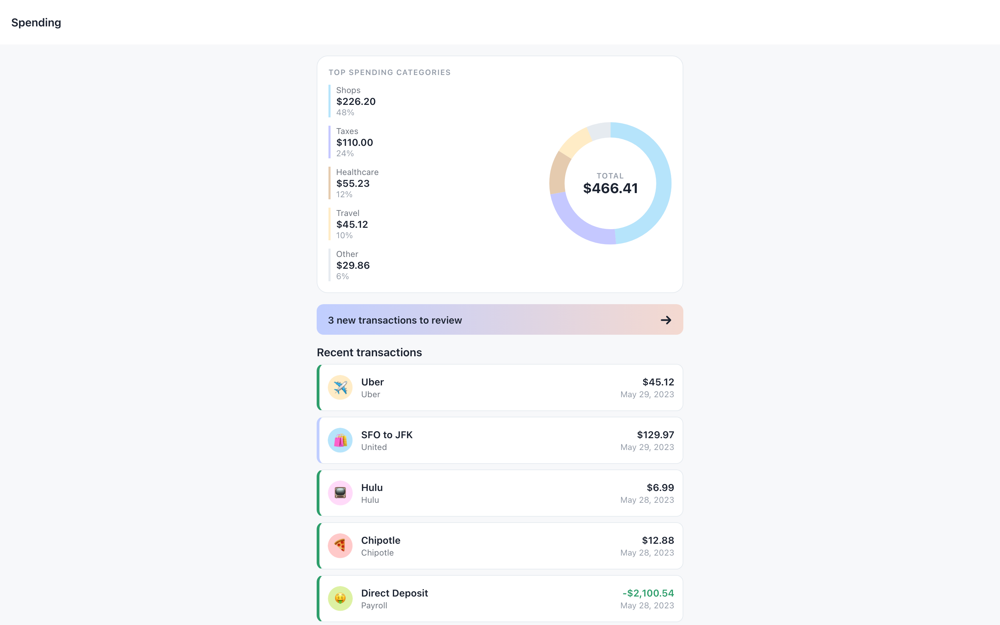
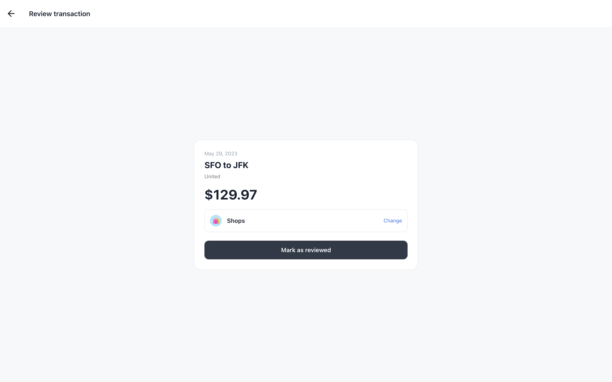
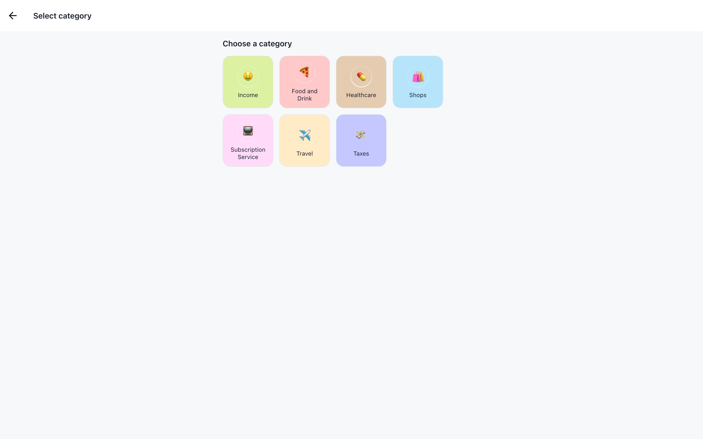
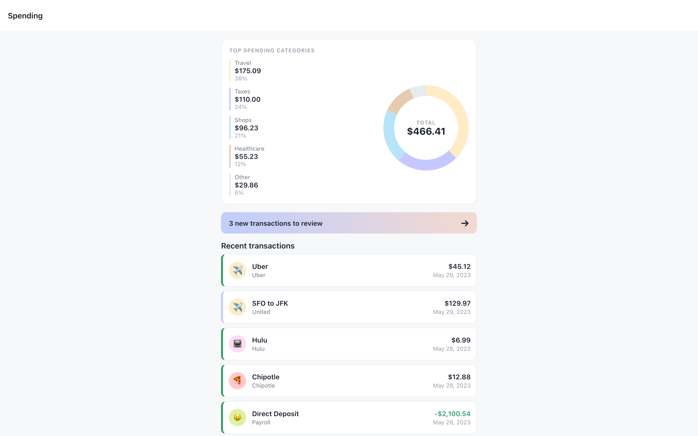
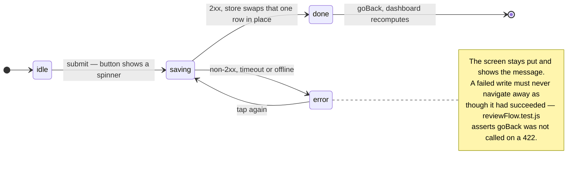

# Peach — transaction reviewer

A React Native client for a personal-finance take-home. It draws where the money
went as a donut of spend by category, and it walks you through the transactions the
import left in the wrong bucket: open one, pick a category, mark it reviewed, watch
the breakdown recompute.

The API half of the exercise lives in the sibling repo `peach-assessment-backend`
(Rails over Postgres). This repo is the whole client. The same JavaScript runs on
iOS, Android and the web target, and `android/` and `ios/` are checked in because
this is an Expo **bare** project rather than a managed one.

## What it looks like

| Spending dashboard                                                                                                         | Review a transaction                                                                                                            |
| -------------------------------------------------------------------------------------------------------------------------- | ------------------------------------------------------------------------------------------------------------------------------- |
|  |  |

| Category picker                                                                             | After assigning a category                                                                    |
| ------------------------------------------------------------------------------------------- | --------------------------------------------------------------------------------------------- |
|  |  |

Captured at 1440×900 against the backend's own seed data — the categories and
merchants from its `db/seeds.rb`, the ten rows from its `transactions.csv`.

The **first and last** shots are a before/after pair from a single run. "SFO to JFK"
($129.97) starts filed under **Shops**. Reassigning it to **Travel** takes Travel
from $45.12 / 10% to $175.09 / 38%, and the total stays at $466.41 because nothing
was spent, only relabelled. Every figure on that screen is derived from the API
response — there is no placeholder data anywhere in the render path.

Note the `Taxes` tile in the third shot: the backend seeds that category and ships
no artwork for it, so it renders from the emoji the API sends. That is
[the extension seam](#choices-worth-defending) doing its job.

## Getting it on screen

```bash
yarn install
```

Then a backend, either the real one or the stand-in:

```bash
# A — no Ruby, no Postgres. Stub server, seeded from the backend's own fixtures.
node scripts/mock-api.js --port 3000

# B — the real API, in the sibling repo.
#   bin/setup && bin/rails s        # http://localhost:3000
```

And in a second terminal:

```bash
yarn web        # browser — needs no Xcode and no Android SDK
yarn ios        # needs Xcode
yarn android    # needs the Android SDK
```

`scripts/mock-api.js` is a zero-dependency development tool, not a second
implementation of the contract. It exists so the app can be run, tested and
screenshotted without provisioning a database. The Rails app is the contract.

## What a review actually does

`useReviewTransaction` owns one `PATCH /transactions/:id` and exposes an explicit
status, so the screen can tell "saving" from "saved" from "failed" instead of
assuming the write worked.



Two screens drive that hook. The review card sends `{ reviewed: true }`, the
category picker sends `{ category: { name, emoji } }`, and both go out in the
nested shape the Rails controller permits:
`{transaction: {category_attributes: {name, emoji}}}`. The integration test runs the
real `createHttpClient`, the real endpoint map, the real Reflux actions and the real
screens against a stubbed transport, and asserts the exact URL and the exact body.

## Where the numbers come from

Everything the chart and the list display is a pure function of the API response,
in `src/domain/`. Three rules there are load-bearing and each has a test:

**Amounts are parsed, not concatenated.** Rails serialises `decimal` columns as JSON
strings so no precision is lost through a double. `"45.12" + "129.97"` is
`"45.12129.97"` — a bug that renders perfectly and is wrong by two orders of
magnitude. `toAmount` coerces at the boundary.

**Income is not spending.** `isSpend` rejects the `Income` category and any negative
amount, so the −$2,100.54 payroll deposit does not land in the spending total. The
backend files every imported row under `Shops` until someone reviews it, so without
this rule the first chart a reviewer sees is wrong.

**The slices always sum to the whole.** `categoryTotals` has a test asserting the
shares add to exactly 1, and `topCategories` folds the tail into an `Other` slice
that preserves that. The donut and the legend read the same array, so they cannot
disagree.

## Pointing it at the API

| Variable        | Default                                                       | What it is for                                                                                              |
| --------------- | ------------------------------------------------------------- | ----------------------------------------------------------------------------------------------------------- |
| `PEACH_API_URL` | `http://localhost:3000`, or `http://10.0.2.2:3000` on Android | Base URL of the Rails API. Read in `app.config.js`, surfaced as `expo.extra.apiBaseUrl`. No trailing slash. |
| `PORT`          | `3000`                                                        | Port for `scripts/mock-api.js`. Also accepted as `--port`.                                                  |

Copy `.env.example` if you want somewhere to keep it. The Android default is not
cosmetic: an emulator cannot reach `localhost`, because that name resolves to the
emulator itself — it needs the `10.0.2.2` host alias, and `src/config/env.js` picks
it per platform so nobody has to remember.

Values that look configured but are not — an empty string, a literal `"undefined"`,
a scheme-less host, a trailing space picked up from an env file — are rejected and
the platform default is used instead. `env.test.js` covers each one. The failure
being designed out is a request to `undefined/transactions` with an error message
that never says why.

`src/api/peachApi.js` is the whole endpoint map, and it is deliberately narrow:

```
GET   /categories
GET   /merchants
GET   /transactions[?pending_review=true|?reviewed=true]
GET   /transactions/:id
PATCH /transactions/:id
```

## Layout

```
App.js                    Composition root: starts loading, renders the navigator
app/                      Reflux scaffolding the exercise ships with
  actions/apiActions.js     Dispatch and async result reporting
  stores/apiStore.js        Slices, AsyncStorage cache, debounced writes
src/
  api/httpClient.js       The only file in the app that knows fetch exists
  api/peachApi.js         Endpoint map
  config/env.js           Base-URL resolution and sanitising
  domain/                 Pure logic: money, transactions, categoryIcons
  state/                  useSyncExternalStore bridge, derived selectors, the review hook
  screens/                One directory per route
  ui/                     theme.js tokens and presentational components
  test-support/           Payloads shaped like real API responses
scripts/mock-api.js       Stand-in for the Rails API
```

Dependencies point inward. Screens read hooks, hooks read the store, the store
reads the domain, and nothing below `src/api` knows that HTTP exists. That is why
95 of the 125 tests need no renderer at all — they are function calls.

## Choices worth defending

**Reflux was kept, not replaced.** It is abandonware and nothing greenfield would
choose it — but `app/actions` and `app/stores` are the skeleton the exercise hands
you, and rewriting the provided harness to demonstrate a preference is not what the
exercise asks. It was made correct instead: listeners register synchronously so no
response can arrive before the store is listening, failures route to `.failed`
rather than being written into the store as if they were data, and React reads it
through `useSyncExternalStore` so concurrent renders cannot tear.

**The category grid is data, not a layout.** `src/domain/categoryIcons.js` resolves
an icon in three steps — bundled artwork, then the emoji from the API, then a
lettered chip. The backend owns the category list and is free to grow it, so a new
category renders correctly with no frontend change at all, and shipping artwork for
it later is one `registerCategoryIcon` call rather than an edit to a screen.

**No charting library.** The donut is 71 lines of `react-native-svg`, which the
project already depends on for icons. A chart package that ships an entire layout
and animation runtime to draw one ring is the largest thing a cold start would have
to download and parse, and this ring is arcs and a `strokeDashoffset`.

**The list is virtualised and the cache is debounced.** `TransactionList` is a
`FlatList` with `getItemLayout` over a fixed 68px row, so it never measures a row to
scroll. `apiStore` coalesces snapshot writes behind a 400 ms window — there is a
test asserting that three slices landing produce exactly one `setItem`, rather than
serialising the whole payload three times on the JS thread.

**The offline cache is advisory.** Hydration from AsyncStorage is asynchronous and
only fills slices the network has not already answered, so a slow disk read cannot
clobber a fresh response. A corrupt or unreadable cache is swallowed — it is a
convenience, not a source of truth.

## Checks

```bash
yarn test              # 13 suites, 125 tests
yarn test:coverage
yarn lint              # eslint, --max-warnings=0
yarn format:check
```

`jest.setup.js` replaces `global.fetch` with a function that throws, so a forgotten
mock fails loudly instead of hanging or quietly reaching a real server.

## Known gaps

- **The client ignores the API's pagination.** The backend pages `GET /transactions`
  (`page`, `per_page`, and `X-Total-Count` / `X-Total-Pages` response headers), and
  `httpClient` reads only the body. At ten seeded rows it does not matter. At ten
  thousand the dashboard would silently chart the first page.
- **Only two of the four server-side filters are wired.** `peachApi` sends
  `pending_review` and `reviewed`. The backend also filters on `category_id` and
  `merchant_id`.
- **Validation messages are not surfaced.** A 422 carries `{"message": [...]}`, but
  `httpClient` raises from the status line alone, so the user sees "failed with HTTP
  422" rather than what was wrong.
- **No authentication.** The API has none, so neither does the client — no user, no
  session, no per-user data.
- **No write queue.** A failed PATCH is reported and the screen stays put. No retry,
  no optimistic update, no outbox.
- **Cached data can go stale.** No ETag and no `updated_at` check — a refresh
  replaces a slice wholesale.
- **Dates render in UTC.** The API sends a bare `date` with no zone. Treating it as
  UTC stops a transaction sliding to the previous day west of Greenwich, but it is a
  choice, not a correct answer.
- **The web target is a convenience, not a product.** It exists so the app can be
  run and reviewed without Xcode or the Android SDK. The content column is capped
  and centred and that is the whole of the desktop story. The Docker image builds
  that web target only — a container cannot produce an iOS or Android binary.
