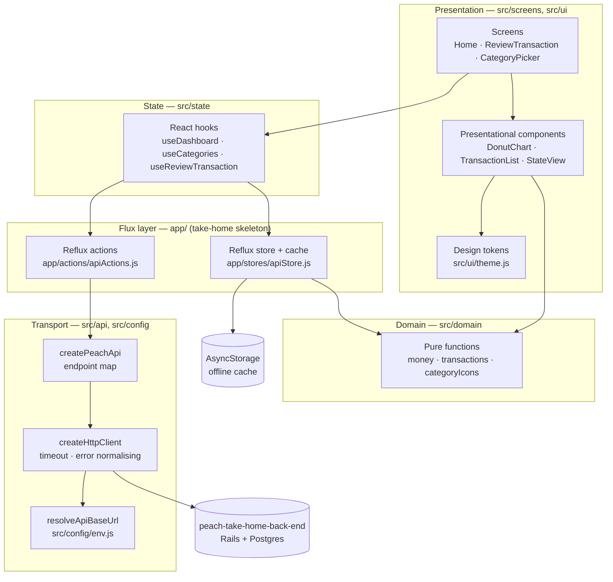
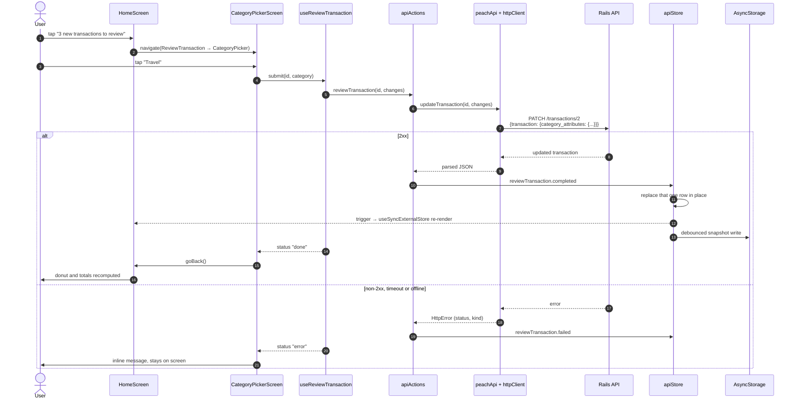

# Peach — transaction review client

A React Native client for the Peach take-home exercise. It shows where your money
went, and it walks you through the transactions the bank has not categorised yet:
pick a category, mark the transaction reviewed, and the spending breakdown updates.

It talks to `peach-take-home-back-end` — the companion Rails API backed by Postgres. The same JavaScript runs on iOS, Android and the web target;
`android/` and `ios/` are checked in because this is an Expo _bare_ project.

---

## Screenshots

Captured at 1440×900 against the seeded dataset (the backend's own
`db/seeds.rb` categories and `transactions.csv` rows). See
[Development](#development) for how to reproduce them.

| Spending dashboard                                                                                                        | Review a transaction                                                                |
| ------------------------------------------------------------------------------------------------------------------------- | ----------------------------------------------------------------------------------- |
|  |  |

| Category picker                                                                      | After assigning a category                                                                            |
| ------------------------------------------------------------------------------------ | ----------------------------------------------------------------------------------------------------- |
|  |  |

The last two shots are a before/after pair from one run: "SFO to JFK" ($129.97)
starts under **Shops**, is reassigned to **Travel**, and the donut recomputes —
Travel goes from $45.12 (10%) to $175.09 (38%). Nothing in the chart is hardcoded.

---

## Architecture

Layered, with dependencies pointing inward. Screens know about hooks, hooks know
about the store, the store knows about the domain — and nothing below the API
layer knows that HTTP exists.



**Why it is shaped this way.** `app/actions` and `app/stores` are the Reflux
scaffolding the exercise ships with, and the README that came with it says to put
the backend URL in `apiActions.js`. Rather than tear that out, it is kept as the
dispatch seam and everything else grew around it: HTTP moved down into
`src/api`, business rules moved down into `src/domain`, and React reads the store
through `useSyncExternalStore` instead of ad-hoc `listen` callbacks. The result is
that the only file that knows a `fetch` exists is `httpClient.js`, and every
calculation in the app is a pure function with a test.

---

## Review flow

What happens when you tap a pending transaction and give it a category.



---

## Quickstart

```bash
yarn install

# Option A — no Ruby, no Postgres. Stub API with the backend's own seed data.
node scripts/mock-api.js --port 3000

# Option B — the real thing, in the sibling repo.
#   bundle install && bin/rails db:prepare && bundle exec rake db:seed && rails s

# Then, in a second terminal:
yarn ios        # or: yarn android
yarn web        # browser, no Xcode or Android SDK needed
```

`yarn ios` / `yarn android` build the native projects and need Xcode or the
Android SDK. `yarn web` needs neither.

---

## Configuration

| Variable        | Required | Default                                                               | Purpose                                                                                                                  |
| --------------- | -------- | --------------------------------------------------------------------- | ------------------------------------------------------------------------------------------------------------------------ |
| `PEACH_API_URL` | No       | `http://localhost:3000` on iOS/web, `http://10.0.2.2:3000` on Android | Base URL of the Rails API. Read in `app.config.js` and exposed to the app as `expo.extra.apiBaseUrl`. No trailing slash. |
| `PORT`          | No       | `3000`                                                                | Port for `scripts/mock-api.js`. Also settable as `--port`.                                                               |

Copy `.env.example` if you want a file to keep it in. The default matters more
than it looks: an Android emulator cannot reach `localhost`, because that
resolves to the emulator itself — it needs the `10.0.2.2` host alias, and
`src/config/env.js` picks it per platform so nobody has to remember.

Values that look configured but are not — an empty string, a literal
`"undefined"`, a URL with no scheme, a trailing space from an env file — are
rejected and the platform default is used instead. That is deliberate: the usual
failure mode is a request to `undefined/api` with a useless error message.

---

## Development

```bash
yarn test              # jest, 125 tests
yarn test:coverage     # with a coverage report
yarn lint              # eslint, zero warnings tolerated
yarn format            # prettier
```

Every test runs with the network stubbed; `jest.setup.js` replaces `global.fetch`
with a function that throws, so a forgotten mock fails loudly instead of hanging
or reaching a real server.

To reproduce the screenshots:

```bash
node scripts/mock-api.js --port 8861 &
PEACH_API_URL=http://localhost:8861 npx expo export:web
cd web-build && python3 -m http.server 8860
# then drive http://localhost:8860 at 1440x900
```

---

## Project structure

```
App.js                      Composition root: kicks off loading, renders the navigator
app/                        Reflux scaffolding from the take-home skeleton
  actions/apiActions.js       Dispatch + async result reporting (injectable client)
  stores/apiStore.js          Immutable slices, AsyncStorage cache, debounced writes
src/
  api/
    httpClient.js             fetch wrapper: timeout, abort, HttpError normalising
    peachApi.js               Endpoint map matching the Rails routes exactly
  config/env.js               Base-URL resolution and sanitising
  domain/
    money.js                  Amount parsing (Rails sends decimals as strings)
    transactions.js           Normalising, spend classification, category totals
    categoryIcons.js          Icon registry — the extension seam
  state/
    apiState.js               useSyncExternalStore bridge + derived selectors
    useReviewTransaction.js   One PATCH, with an explicit status
  screens/                    One directory per route
  ui/
    theme.js                  Colour, spacing, type and layout tokens
    components/               Presentational only, no data access
  test-support/fixtures.js    Payloads shaped like the real API responses
scripts/
  mock-api.js                 Zero-dependency stand-in for the Rails API
  seed.json                   The backend's own seed data
docs/screenshots/             Captured UI
android/  ios/                Bare-workflow native projects (Gradle / Xcode)
```

---

## Design notes

**Business logic is pure and lives in `src/domain`.** Totals, percentages, spend
classification and date formatting are functions of their arguments. That is why
the donut and the legend can never disagree, and why `categoryTotals` has a test
asserting the shares sum to exactly 1 — the original chart hardcoded a 35% and a
55% slice and silently lost a tenth of the circle.

**Income is not spending.** `isSpend` excludes the `Income` category and any
negative amount, so a $2,100.54 payroll deposit does not inflate the spending
total. The backend seeds every CSV row into `Shops`, so without that rule the
first chart you see is wrong.

**Amounts are parsed, not concatenated.** Rails serialises `decimal` columns as
JSON strings. `"45.12" + "129.97"` is `"45.12129.97"`, which is the kind of bug
that renders fine and is wrong by two orders of magnitude. `toAmount` coerces at
the boundary and `money.test.js` pins it.

**Scalability: the bundle was the real bottleneck.** This is a phone app hitting a
small dataset — there is no N+1 query to fix and no queue worth adding. What there
_was_ is `victory-native`, which drags in the whole `victory` package to draw one
ring. The donut is now ~60 lines of `react-native-svg`, which was already a
dependency. Measured with `expo export:web`, entrypoint size:

| Build                 | Entrypoint   |
| --------------------- | ------------ |
| With `victory-native` | **1.24 MiB** |
| With the SVG donut    | **622 KiB**  |

That is half the JavaScript a cold start has to download, parse and execute.

Two smaller ones, in the same spirit of fixing what is actually there:

- **The list is virtualised.** `TransactionList` is a `FlatList` with a
  `getItemLayout` (every row is a fixed 68px), so it never measures rows and
  scrolls a long ledger without jank. The original rendered one hardcoded row
  inside a fixed-height `View`.
- **Persistence is debounced.** The old store called
  `AsyncStorage.setItem(JSON.stringify(everything))` on _every_ trigger, so three
  responses landing meant serialising the whole payload three times on the JS
  thread. Writes now coalesce behind a 400 ms window; there is a test that asserts
  three slices landing produce exactly one write.

**Extensibility: the category icon registry.** The backend owns the category list
and is free to add to it. `src/domain/categoryIcons.js` resolves an icon in three
steps — bundled artwork, then the emoji the API already sends, then a lettered
chip — so a brand-new category renders correctly with _no frontend change at all_,
and shipping artwork for it later is one `registerCategoryIcon` call rather than an
edit to a screen. You can see this working in the third screenshot: `Taxes` is
seeded by the backend, has no bundled illustration, and still renders as 💸.

The second seam is injection. `createHttpClient` takes a `fetchImpl` and
`configureApi` swaps the whole client, which is how the integration tests drive
the real HTTP stack against a stub transport rather than monkey-patching globals.

**Offline cache is advisory, never authoritative.** The store hydrates from
AsyncStorage asynchronously and only fills slices the network has not already
answered, so a slow disk read cannot clobber a fresh response. A corrupt or
unreadable cache is swallowed — it is a convenience, not a source of truth.

**Reflux was kept, not replaced.** It is abandonware, and a greenfield app would
use something else. But it is the skeleton the exercise provides, and rewriting
the provided harness to prove a preference is not what the exercise is asking for.
It was made correct instead: listeners registered synchronously, failures routed to
`.failed` rather than being written into the store as data, and `useSyncExternalStore`
on the React side so renders cannot tear.

---

## Limitations

- **No authentication.** The Rails API has none, so neither does the client. There
  is no user, no session and no per-user data.
- **No pagination.** `GET /transactions` returns everything. The backend exposes
  `?pending_review` and `?reviewed` filters, which `peachApi` supports, but there
  is no cursor or page parameter to use. At the seeded scale (10 rows) it does not
  matter; at 10,000 it would, and the fix belongs in the API first.
- **No write queue.** A failed PATCH is reported and the screen stays put. There is
  no retry, no optimistic update and no outbox — you tap again.
- **Cached data can be stale.** There is no ETag or `updated_at` check; a refresh
  replaces a slice wholesale.
- **Dates are rendered in UTC.** The API sends a bare `date` with no zone. Treating
  it as UTC keeps a transaction from sliding to the previous day west of Greenwich,
  but it is a choice, not a correct answer.
- **The web target is a convenience, not a product.** It exists so the app can be
  run and reviewed without Xcode or the Android SDK. It is not laid out for
  desktop: the content column is capped and centred, and that is the whole of it.
- **Docker covers the web build only.** A container cannot produce an iOS or
  Android binary — that is Xcode and Gradle on a real machine, or EAS Build.
- **`scripts/mock-api.js` is a development stand-in.** It holds state in memory,
  has no validation to speak of, and is not the API contract — the Rails app is.
